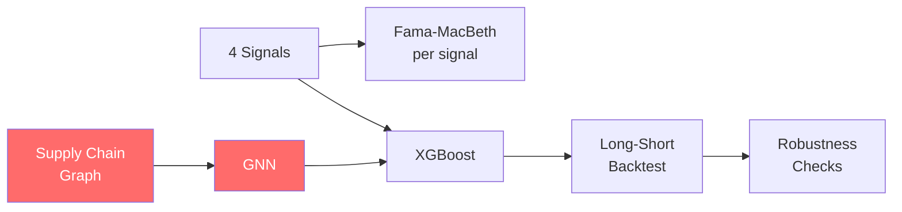

# Thesis Scope Narrowing: Strategy & Recommendations

The thesis as proposed is roughly **2–3 papers' worth of work**. Below are concrete levers to shrink it to a single, coherent, achievable thesis while preserving what makes it original.

---

## Core Diagnosis: Where the Scope Explodes



The red nodes—**graph construction** and **GNN training**—are where complexity concentrates. Graph construction is hard because Bloomberg SPLC has poor MDAX/SDAX coverage and is not time-varying. The GNN adds PyTorch Geometric, hyperparameter tuning, and over-smoothing risk. Together they can easily consume 50%+ of your time budget.

---

## Recommended Approach: "Two-Tier" Thesis Design

Structure the thesis as a **core** (guaranteed deliverable) and an **extension** (stretch goal), with the extension designed so that even a partial result is publishable.

### Tier 1 — Core Thesis (Minimum Viable Thesis)

> **"Alternative Data Signals and Machine Learning in the German Equity Market"**

| Component | What You Do | Simplification |
|-----------|-------------|----------------|
| **Signals** | Build **3 signals** instead of 4: analyst revision momentum, SUE, WpHG insider filings | Drop short interest—it has pre-2012 data gaps and is the least novel for a German market study |
| **Universe** | Focus on **MDAX + SDAX only** (~100 firms) | Drop DAX—it's efficiently priced and adds data work without adding to your information-asymmetry story |
| **Testing** | Fama-MacBeth per signal with Newey-West | Unchanged |
| **ML Model** | XGBoost on the 3 signals + standard controls (beta, size, B/M, momentum) | No GNN yet |
| **Backtest** | Long-short quintile portfolio, monthly rebalance | Unchanged |
| **Period** | 2010–2026 (start later to avoid worst WpHG data gaps) | Lose 4 years but gain data integrity; still includes Euro crisis, COVID, energy crisis |

**This alone is a complete, publishable thesis.** Three alternative signals tested via both linear (Fama-MacBeth) and non-linear (XGBoost) methods in the underexplored German mid/small-cap market, with SHAP interpretability.

---

### Tier 2 — Extension: Simplified Network Alpha

Instead of a full GNN, capture the network hypothesis with a **much simpler proxy** that still tests H5 (Network Alpha) and opens the door to future GNN work.

#### Option A: "Neighbor-Averaged Signals" (Recommended — Simplest)

For each firm, compute the **average signal value of its supply chain neighbors**. Feed these "network features" into XGBoost alongside the firm's own signals.

```
For firm i at time t:
    own_signal_i,t     = analyst_momentum_i,t
    network_signal_i,t = mean(analyst_momentum_j,t)  for all j ∈ neighbors(i)
```

- **No GNN needed.** No PyTorch Geometric. Just a few extra columns in your feature matrix.
- **Still tests H5:** If `network_signal` has high SHAP importance, you've demonstrated that supply chain information propagation matters.
- **Graph source:** Use a **static** customer-supplier mapping from Bloomberg SPLC for the ~50 largest MDAX/SDAX firms where coverage exists. Supplement with manual extraction from annual report segment disclosures (IFRS 8). You only need to do this **once**, not time-varying.
- **Academic precedent:** Cohen & Frazzini (2008) used exactly this approach—no GNN, just "customer portfolio returns predict supplier returns"—and published in the *Journal of Finance*.

#### Option B: "Industry-Level Network" (Moderate Complexity)

Instead of firm-level supply chain links, use **Destatis input-output tables** (publicly available) to define industry-level connections. If Industry X supplies 25% of its output to Industry Y, then firms in Y are "neighbors" of firms in X.

- **Pro:** Complete coverage, time-varying (Destatis updates I-O tables every few years), no Bloomberg SPLC dependency.
- **Con:** Much less granular—you're saying "automotive suppliers" rather than "BMW's tier-1 suppliers."
- **Implementation:** One extra feature per firm: the output-weighted average signal of its upstream/downstream industries.

#### Option C: "GNN-Lite" (Higher Complexity, Only If Time Permits)

If Tier 1 is done by mid-May and you want to push further:

1. Build a small graph (~80 nodes) covering MDAX firms only with edges from Bloomberg SPLC + annual reports
2. Use a **1-layer GraphSAGE** (not GAT—simpler, less hyperparameter tuning)
3. Use the GNN purely as a feature extractor: produce 8-dim node embeddings → feed into XGBoost
4. Compare XGBoost-only vs. XGBoost+GNN to measure marginal network alpha

This is still dramatically simpler than the original proposal's full GNN-XGBoost hybrid.

---

## Recommended Hypothesis Revision (Simplified)

With the narrowed scope, the hypotheses become cleaner:

| # | Hypothesis |
|---|-----------|
| **H1a** | Analyst revision momentum is positively associated with subsequent abnormal returns in MDAX/SDAX stocks |
| **H1b** | WpHG/MAR insider net purchases are positively associated with subsequent abnormal returns in MDAX/SDAX stocks |
| **H1c** | Standardized earnings surprise (SUE) is positively associated with subsequent abnormal returns |
| **H2** | An XGBoost model combining all three signals generates statistically significant Carhart alpha, outperforming the best single-signal portfolio |
| **H3** | *[Extension]* The average signal strength of a firm's supply chain neighbors has incremental predictive power beyond the firm's own signals |

H3 is the "network alpha" hypothesis, now cleanly separated as the extension.

---

## Revised Timeline

| Phase | Task | Timing | Status |
|-------|------|--------|--------|
| **1** | Bloomberg data extraction (prices, analyst revisions, insider filings, SUE) for MDAX+SDAX | **Now – April 15** | Start immediately |
| **2** | Signal construction + Fama-MacBeth univariate tests | April 15 – May 1 | |
| **3** | XGBoost model training + SHAP analysis | May 1 – May 20 | |
| **4** | Long-short portfolio backtest + transaction costs | May 20 – June 1 | **Draft submission checkpoint** |
| **5** | *[Extension]* Neighbor-averaged signals → test H3 | June 1 – June 20 | Only if Tier 1 complete |
| **6** | Writing, robustness checks, revisions | June 20 – July 25 | |
| **Submit** | Final thesis to Moodle | **July 29** | |

> [!TIP]
> The key insight: by using "neighbor-averaged signals" (Option A) instead of a GNN, you reduce the **network alpha** component from ~6 weeks of work (graph construction + GNN architecture + training + debugging) to roughly **1 week** (build static graph + compute averages + add features to XGBoost). You still get to write about supply chain information propagation, cite the same literature, and test the same economic hypothesis—just with a simpler, more robust method.

---

## What You Preserve vs. What You Cut

| ✅ Preserved | ❌ Cut/Simplified |
|-------------|-------------------|
| German market gap contribution | DAX (efficiently priced, not needed) |
| WpHG/MAR insider signal (most novel) | Short interest signal (data problems) |
| XGBoost + SHAP interpretability | Full GNN pipeline → simple neighbor averages |
| Fama-MacBeth linear baseline | Time-varying graph reconstruction |
| Network alpha hypothesis (H3) | PyTorch Geometric dependency |
| Multi-regime robustness (2010–2026) | 2006–2009 (data integrity issues) |
| Long-short backtest with transaction costs | Complex GNN-XGBoost hybrid architecture |

---

## Decision Points for You

1. **Signals:** Are you comfortable dropping short interest? Or would you prefer to drop SUE instead and keep short interest (starting from 2012)?
2. **Universe:** MDAX+SDAX only, or do you want to keep DAX for completeness? (I'd argue drop it—but it's your call.)
3. **Network approach:** Option A (neighbor-averaged signals) is by far the simplest path to testing network alpha. Are you okay with this, or is the GNN itself a learning goal you want to pursue regardless of thesis efficiency?
